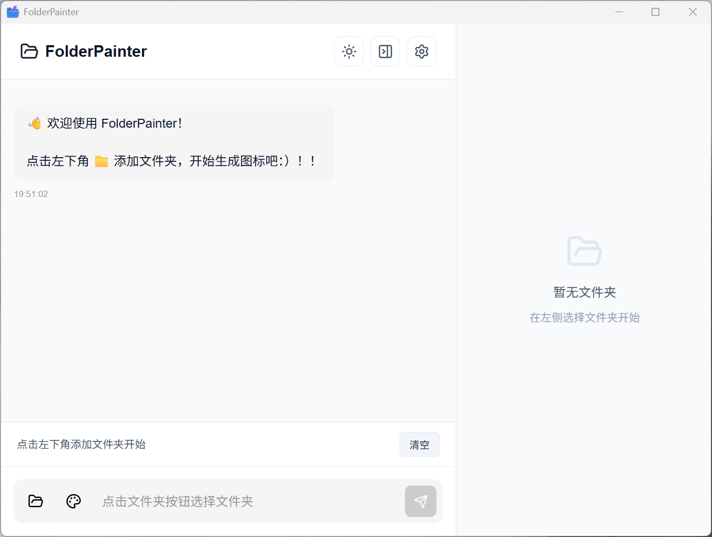
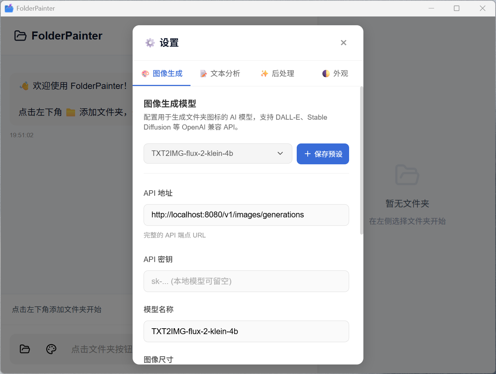
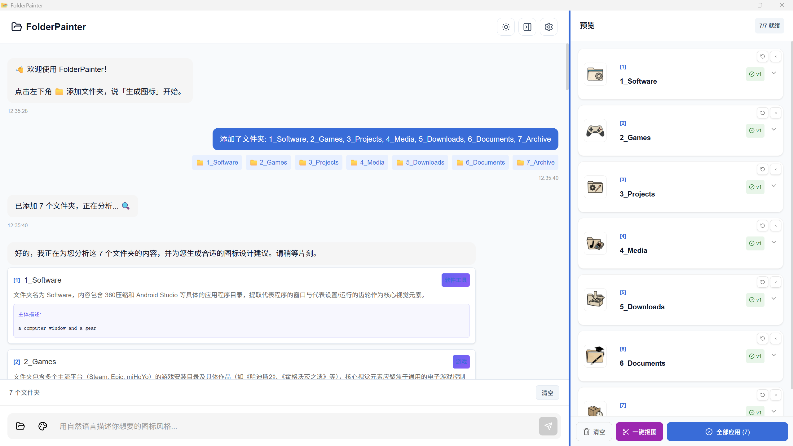
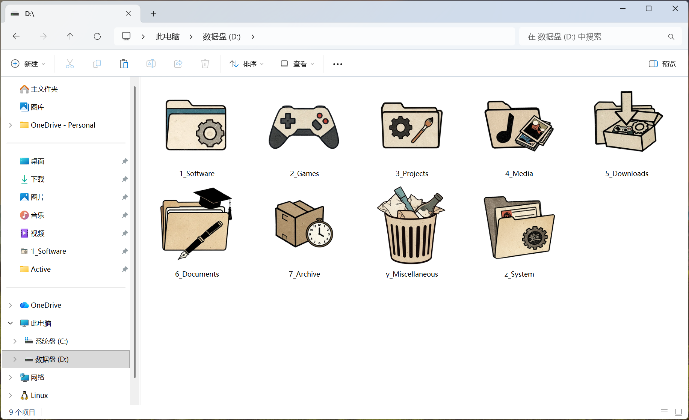

<div align="center">
  

  <h1>FolderPainter</h1>

  <p><strong>AI 驱动的 Windows 文件夹图标个性化工具</strong></p>
    <p><strong>一键生成独特好看的图标:)</strong></p>

  <p>
    
    
    
    
    
  </p>

  <p>
    <a href="#-功能特性">功能特性</a> •
    <a href="#-快速开始">快速开始</a> •
    <a href="#-使用指南">使用指南</a> •
    <a href="#-配置说明">配置说明</a> •
    <a href="#-开发">开发</a>
  </p>

  <p>
    <strong>简体中文</strong> |
    <a href="./README_EN.md">English</a>
  </p>
</div>

---

## ✨ 功能特性

<table>
<tr>
<td width="50%">

### 🤖 AI 智能分析
- 自动扫描文件夹内容结构
- LLM 分析并生成图标建议
- 支持自然语言对话交互

</td>
<td width="50%">

### 🎨 多样化风格
- 预设多种艺术风格模板
- 支持自定义风格描述
- 支持智能对话交互

</td>
</tr>
<tr>
<td>

### 🖼️ 图像处理
- AI 图像生成
- 一键背景移除
- 多版本预览与对比

</td>
<td>

### 💾 模板管理
- 创建/编辑/删除自定义模板
- 模板导入/导出分享
- 多语言支持 (中文/English)

</td>
</tr>
</table>

---

## 📸 界面预览

<!-- 添加截图 -->
| 主界面 | 模板库 |
|--------|--------|
|  |  |

| 设置 | 预览面板 |
|------|----------|
|  |  |

| 生成结果展示 | 
|------|
|  | 
此为`genimi-3-flash`作为文本模型 + `ComfyUI`中`FLUX-2-KLEIN-4B-FP8`做为图片模型生成的效果

## 🚀 快速开始

### 下载安装

从 [Releases](https://github.com/你的用户名/FolderPainter/releases) 下载最新版本：

| 版本 | 说明 |
|------|------|
| `FolderPainter_x.x.x_x64-setup.exe` | 安装版 (推荐) |
| `FolderPainter_x.x.x_x64_en-US.msi` | MSI 安装包 |

### 配置 API

首次使用需要配置 AI 模型 API：

1. 点击右上角 ⚙️ 打开设置
2. 配置**图像生成模型** (必需)
3. 配置**文本分析模型** (可选，启用智能对话)
4. 点击「测试连接」确认配置正确

#### 支持图像模型格式

支持openai格式的端点调用
`/v1/images/generations`
已适配魔搭api格式

#### 支持文本模型格式

支持openai格式的端点调用
`/v1/chat/completions`


## 📖 使用指南

### 基本流程

```
添加文件夹 → AI 分析内容 → 选择/自定义风格 → 生成图标 → 预览 → 应用
```

### 操作步骤

1. **添加文件夹** - 点击左下角 📁 或拖拽文件夹到窗口
2. **选择风格** - 从模板库选择，或用自然语言描述
3. **生成图标** - 点击「生成图标」或说「生成」
4. **预览调整** - 在右侧面板查看多个版本
5. **应用图标** - 满意后点击「应用」

### 进阶技巧

- 💡 **批量处理**: 一次添加多个文件夹，批量生成和应用
- 💡 **背景移除**: 启用抠图功能获得透明背景图标
- 💡 **模板分享**: 导出模板 JSON 分享给他人
- 💡 **还原图标**: 支持一键还原到系统默认图标

---

## ⚙️ 配置说明

### 数据存储

用户数据存储在 `%APPDATA%\FolderPainter\`：

```
FolderPainter/
├── config.json    # API 配置
└── history.db     # 模板和历史记录
```

### 背景移除服务

使用免费的 HuggingFace Space 服务：

- BRIA RMBG 2.0 
- BRIA RMBG 1.4
- not-lain/background-removal
- KenjieDec/RemBG

---

## 🛠️ 开发

### 环境要求

- Node.js 18+
- Rust 1.70+
- Windows 10/11

### 本地开发

```bash
# 克隆项目
git clone https://github.com/qup1010/FolderPainter.git
cd FolderPainter

# 安装依赖
npm install

# 启动开发服务器
npm run tauri dev
```

### 构建发布

```bash
# 构建生产版本
npm run tauri build
```

构建产物在 `src-tauri/target/release/bundle/`

### 项目结构

```
FolderPainter/
├── src/                    # React 前端
│   ├── components/         # UI 组件
│   ├── hooks/              # React Hooks
│   ├── locales/            # 国际化文件
│   └── utils/              # 工具函数
├── src-tauri/              # Rust 后端
│   └── src/
│       ├── ai_client.rs    # AI API 调用
│       ├── templates/      # 模板管理
│       ├── preview.rs      # 预览会话
│       └── ...
└── public/                 # 静态资源
    └── template-covers/    # 预设模板封面
```

---

## 📝 注意事项

- 🔒 **隐私安全**: AI 仅分析文件夹名称和目录结构，**不会读取文件内容**
- 🌐 **网络需求**: 需要网络连接调用 AI API
- 💰 **API 费用**: 图像生成会消耗 API 额度，图标要求比较低，建议使用较小分辨率
- 🖥️ **系统要求**: 仅支持 Windows 10/11

---

## 🤝 贡献

欢迎提交 Issue 和 Pull Request！

---

## 📄 开源协议

[MIT License](LICENSE)

---

<div align="center">
  <p>如果这个项目对你有帮助，请给个 ⭐ Star 支持一下！</p>
</div>
