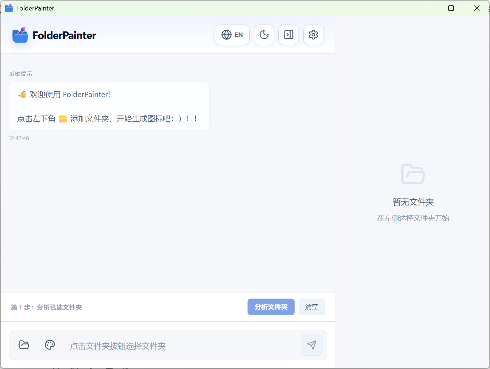
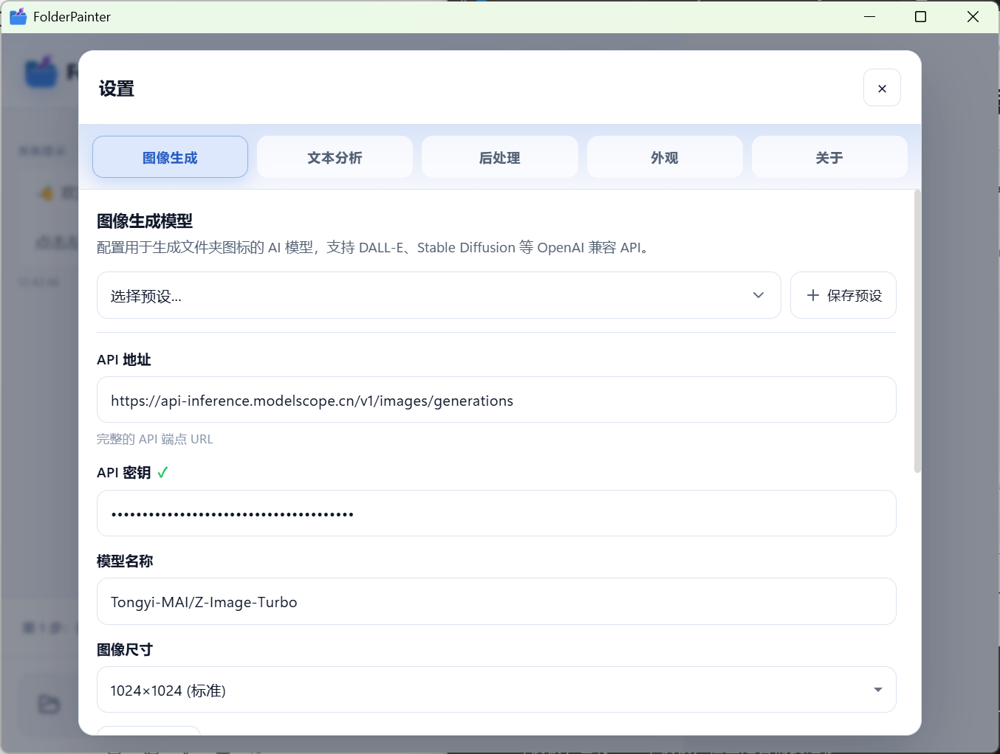

<div align="center">
  

  <h1>FolderPainter</h1>

  <p>用 AI 为 Windows 文件夹生成并应用图标。</p>

  <p>
    
    
    
    
    
  </p>

  <p>
    <a href="#项目简介">项目简介</a> |
    <a href="#功能">功能</a> |
    <a href="#界面截图">界面截图</a> |
    <a href="#快速开始">快速开始</a> |
    <a href="#使用流程">使用流程</a> |
    <a href="#配置说明">配置说明</a> |
    <a href="#开发">开发</a>
  </p>

  <p>
    <strong>简体中文</strong> |
    <a href="./README_EN.md">English</a>
  </p>
</div>

---

## 项目简介

FolderPainter 是一个面向 Windows 的文件夹图标工具。它会根据文件夹名称和目录结构生成图标建议，并调用文本模型和图像模型生成可直接应用的结果。

它适合这些场景:

- 想给项目目录、素材库、收藏夹做更直观的分类
- 希望批量整理文件夹图标，而不是手动找图
- 已经有自己的模型接口，想接到本地工具里使用

## 功能

- 分析文件夹结构，生成图标方向和提示词
- 支持模板库，也支持自然语言描述风格
- 支持多版本预览、对比和应用
- 支持背景移除，便于生成透明图标
- 支持导入、导出模板
- 支持恢复系统默认图标

## 界面截图

| 主界面 | 设置界面 |
| --- | --- |
|  |  |

| 模板库 | 文件夹分析 |
| --- | --- |
|  |  |

| 预览界面 |
| --- |
|  |

| 生成效果示例 |
| --- |
|  |

上面的示例图标由 `gemini-3-flash` 负责文本分析，`ComfyUI` 中的 `FLUX-2-KLEIN-4B-FP8` 负责图像生成。

如果你希望把 ComfyUI 模型接到本项目里，可以参考:
[Comfyui2Openai](https://github.com/qup1010/Comfyui2Openai?tab=readme-ov-file)

## 快速开始

使用前至少需要准备两个接口:

- 一个文本模型接口，用于分析文件夹内容和生成提示词
- 一个图像生成接口，用于生成图标

### 下载

从 [Releases](https://github.com/qup1010/FolderPainter/releases) 下载最新版本:

| 文件 | 说明 |
| --- | --- |
| `FolderPainter_x.x.x_x64-setup.exe` | 安装版，推荐 |
| `FolderPainter_x.x.x_x64_en-US.msi` | MSI 安装包 |

### 首次配置

1. 打开右上角设置。
2. 配置图像生成模型接口。
3. 配置文本分析模型接口。
4. 点击“测试连接”确认可用。

### 支持的接口格式

图像生成接口支持 OpenAI 兼容格式:

`/v1/images/generations`

文本模型接口支持 OpenAI 兼容格式:

`/v1/chat/completions`

## 使用流程

```text
添加文件夹 -> 分析内容 -> 选择或描述风格 -> 生成图标 -> 预览 -> 应用
```

### 基本步骤

1. 添加文件夹，或直接拖拽到窗口中。
2. 从模板库选择风格，或者直接输入想要的效果。
3. 生成图标并查看多个候选版本。
4. 选择满意的结果后应用到文件夹。

### 常用功能

- 批量处理多个文件夹
- 一键移除背景
- 导出和导入模板
- 还原系统默认图标

## 配置说明

### 数据存储

用户数据默认保存在 `%APPDATA%\FolderPainter\`:

```text
FolderPainter/
├── config.json    # API 配置
└── history.db     # 模板和历史记录
```

### 背景移除服务

当前使用 HuggingFace Space 上的免费服务:

- BRIA RMBG 2.0
- BRIA RMBG 1.4
- not-lain/background-removal
- KenjieDec/RemBG

使用时请留意对应服务的可用性和使用条款。

## 开发

### 环境要求

- Node.js 18+
- Rust 1.70+
- Windows 10/11

### 本地运行

```bash
git clone https://github.com/qup1010/FolderPainter.git
cd FolderPainter
npm install
npm run tauri dev
```

### 构建

```bash
npm run tauri build
```

构建产物位于 `src-tauri/target/release/bundle/`。

### 项目结构

```text
FolderPainter/
├── src/                     # React 前端
├── src-tauri/              # Rust 后端
├── public/                 # 静态资源
└── assets/                 # README 示例图片
```

## 注意事项

- AI 只分析文件夹名称和目录结构，不会读取文件内容。
- 生成图标和模型对话需要网络连接。
- 图像生成会消耗模型接口额度，图标场景通常不需要很高分辨率。
- 目前仅支持 Windows 10/11。

## 贡献

欢迎提交 Issue 和 Pull Request。

## 许可证

[MIT License](LICENSE)
